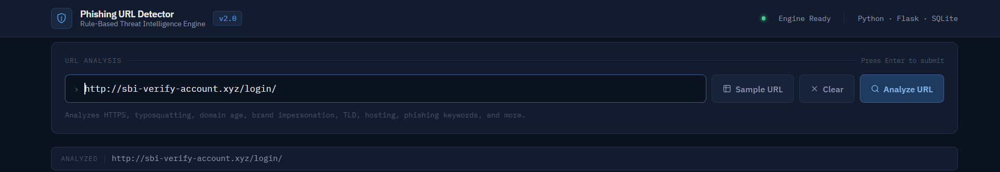
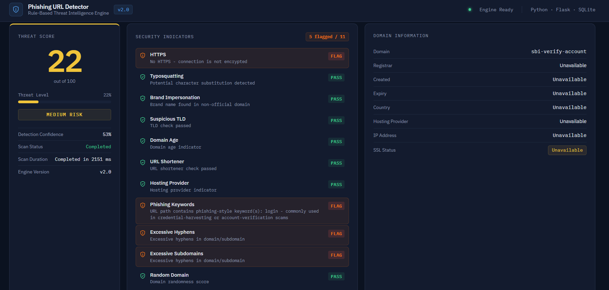
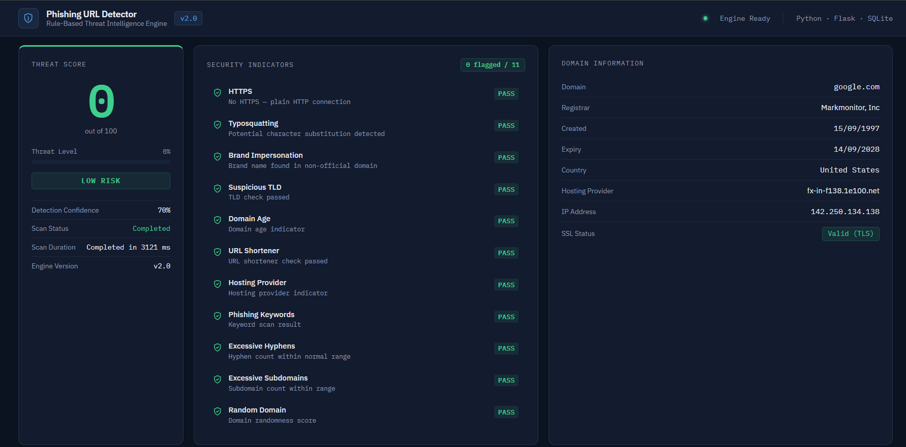
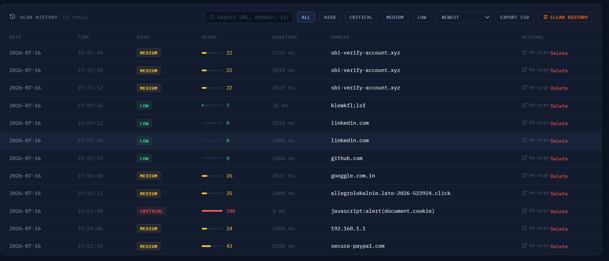

# 🎣 Phishing URL Detector

> **A modular, rule-based phishing URL detection engine built with Python, Flask, and SQLite that analyzes suspicious URLs using multiple independent detection modules and a weighted heuristic scoring system.**

This project detects common phishing indicators such as **typosquatting, brand impersonation, suspicious top-level domains (TLDs), URL obfuscation, hosting-platform abuse, phishing keywords,** and **domain intelligence** to estimate the likelihood that a URL is malicious.

Designed as a hands-on cybersecurity project, it explores **Detection Engineering**, heuristic analysis, backend optimization, and the practical strengths and limitations of rule-based phishing detection.

---
## 🌐 Live Demo

**Try the application:**  
[](https://phishguard-gvur.onrender.com/)

> **Note:** The application is hosted on Render's free tier. If it has been idle, the first request may take 30–60 seconds while the service wakes up.

---

## 📸 Screenshots


| Dashboard | 
|------------|
|  | 

|Threat Analysis |
|-----------------|
| |

|Domain Information |
|-----------------|
| |

| Scan History |
|--------------|
|  |

---

# ✨ Features

### URL Analysis

- HTTPS verification
- Raw IP address detection
- `@` symbol detection
- Excessive subdomain detection
- Excessive hyphen detection
- Long URL detection
- Suspicious TLD detection
- URL shortener detection
- Random / gibberish domain detection

### Threat Intelligence

- Brand impersonation detection
- Typosquatting detection
- Phishing keyword detection
- Unicode / Punycode support
- Domain intelligence
- WHOIS enrichment
- SSL validation
- DNS resolution
- Hosting provider detection

### Scoring Engine

- Weighted heuristic scoring (0–100)
- Confidence calculation
- Low / Medium / High / Critical classification
- Human-readable recommendations

### Dashboard

- Modern SOC-inspired UI
- Interactive scan history
- Search & filtering
- CSV export
- Performance optimized scanning
- SQLite persistence

---

# 🛠 Tech Stack

| Category | Technologies |
|----------|--------------|
| Language | Python 3 |
| Backend | Flask |
| Database | SQLite |
| Frontend | HTML5, CSS3, JavaScript |
| Networking | socket, ssl |
| Intelligence | python-whois, tldextract |
| Performance | ThreadPoolExecutor, caching |
| Version Control | Git & GitHub |

---

# 🏗 Architecture

```text
                 User

                   │

          Flask Web Application
                app.py

                   │

          Detection Engine
             detector.py

                   │

 ┌──────────┬──────────┬──────────┬──────────┐
 │          │          │          │          │
HTTPS     DNS       WHOIS     URL Rules   Brand Rules
 │          │          │          │          │
 └──────────┴──────────┴──────────┴──────────┘

                   │

        Threat Scoring Engine

                   │

     Recommendation + Confidence

                   │

         SQLite Scan History

                   │

             Dashboard UI
```

---

# 📂 Project Structure

```text
phishing-url-detector/

├── data/
│   ├── brands.py
│   ├── hosting_domains.py
│   ├── phishing_keywords.py
│   ├── suspicious_tlds.py
│   └── url_shorteners.py
│
├── templates/
│   └── index.html
│
├── app.py
├── detector.py
├── database.py
├── test_urls.py
├── test_batch.py
├── requirements.txt
├── README.md
└── .gitignore
```

---

# ⚙ Installation

Clone the repository

```bash
git clone https://github.com/swaroop-pixel/phishing-url-detector.git
```

Move into the project

```bash
cd phishing-url-detector
```

Create a virtual environment

```bash
python -m venv venv
```

### Windows

```bash
venv\Scripts\activate
```

### Linux / macOS

```bash
source venv/bin/activate
```

Install dependencies

```bash
pip install -r requirements.txt
```

Run the application

```bash
python app.py
```

Visit

```
http://127.0.0.1:5000
```

---

# 🔍 Detection Modules

The detector performs multiple independent security checks.

| Module | Purpose |
|---------|---------|
| HTTPS | Detect insecure HTTP URLs |
| IP Address | Detect raw IP usage |
| URL Shortener | Identify shortened URLs |
| Suspicious TLD | Detect risky domain extensions |
| Typosquatting | Detect character substitution attacks |
| Brand Impersonation | Detect fake brand domains |
| Phishing Keywords | Detect credential harvesting language |
| Excessive Hyphens | Identify suspicious domain structures |
| Long URLs | Detect URL obfuscation |
| Subdomain Analysis | Detect misleading subdomains |
| Punycode Detection | Identify IDN-based attacks |
| WHOIS Analysis | Domain registration intelligence |
| SSL Analysis | Certificate validation |
| DNS Resolution | Resolve IP & hosting provider |

Each module contributes an independent weighted score toward the final threat assessment while preserving detailed reasoning for every triggered indicator.

---

# 📊 Threat Scoring

| Score | Risk Level |
|-------:|------------|
| **0 – 24** | 🟢 Low |
| **25 – 49** | 🟡 Medium |
| **50 – 74** | 🟠 High |
| **75 – 100** | 🔴 Critical |

The final score is calculated using weighted heuristic rules rather than machine learning.

---

# 📋 Domain Intelligence

The application attempts to collect:

- Hostname
- Registrable Domain
- Registrar
- Domain Creation Date
- Domain Expiration Date
- Domain Age
- Country
- Hosting Provider
- IP Address
- SSL Status

If network lookups fail, the detector continues scanning gracefully and reports unavailable fields without interrupting the analysis.

---

# ⚡ Performance Optimizations

Version 2 introduced several backend improvements:

- Concurrent DNS, SSL, and WHOIS lookups
- ThreadPoolExecutor-based networking
- Lookup caching
- Reduced blocking operations
- Graceful timeout handling
- Independent module execution
- Improved backend reliability

---

# 🧪 Testing

The detector has been evaluated using a mixture of:

- Legitimate websites
- Known phishing URLs
- Brand impersonation examples
- Typosquatting domains
- URL shorteners
- Punycode domains
- Hosting-provider abuse
- Suspicious TLDs
- Random domain generation

The primary objective is reducing false positives while maintaining strong detection coverage.

---

# 📈 Project Statistics

- ✅ 15+ independent detection modules
- ✅ Weighted scoring engine (0–100)
- ✅ Hundreds of phishing keywords
- ✅ Hundreds of suspicious TLDs
- ✅ Large brand reference dataset
- ✅ Modern Flask dashboard
- ✅ SQLite persistence
- ✅ Search & filtering
- ✅ CSV export
- ✅ Domain intelligence
- ✅ Performance optimization
- ✅ Modular architecture

---

# ⚠ Current Limitations

This project is intentionally **rule-based**.

Known limitations include:

- Sophisticated phishing domains without lexical indicators may bypass detection.
- WHOIS information may be unavailable because of registry restrictions or rate limits.
- Reputation services are not yet integrated.
- HTML content is not inspected.
- JavaScript behavior is not analyzed.
- English keyword detection is currently prioritized.

---

# 🚀 Roadmap

## ✅ Version 2 (Completed)

- Modular detection engine
- Weighted scoring (0–100)
- Domain intelligence
- Search & filtering
- CSV export
- Scan history
- Modern dashboard
- Concurrent lookups
- Performance caching

---

## 🔜 Version 3

- VirusTotal API
- Google Safe Browsing
- OpenPhish integration
- PhishTank integration
- DNS reputation analysis
- SSL certificate intelligence
- HTML page inspection
- Passive DNS intelligence

---

## 🔮 Version 4

- Machine Learning classifier
- Browser extension
- REST API
- Docker deployment
- RESTful microservice
- Cloud deployment

---

# 👨‍💻 Author

## Swaroop Morajkar

**Computer Engineering Graduate**

**M.Sc. Cybersecurity Student**

**Aspiring Detection Engineer | SOC Analyst | Security Engineer**

**GitHub**

https://github.com/swaroop-pixel

**LinkedIn**

https://www.linkedin.com/in/swaroop-morajkar-83071a260/

---

# 🤝 Contributing

Contributions, issue reports, feature suggestions, and security improvements are welcome.

If you discover a bug or have an idea for improving the detector, feel free to open an issue or submit a pull request.

---

# 📄 License

This project is licensed under the **MIT License**.

---

# ⚠ Disclaimer

This project was developed for **educational purposes, cybersecurity research, and learning detection engineering concepts.**

It should **not** be considered a replacement for enterprise-grade phishing detection platforms.

Always combine heuristic analysis with reputation services, threat intelligence feeds, and other security controls when making security decisions.
